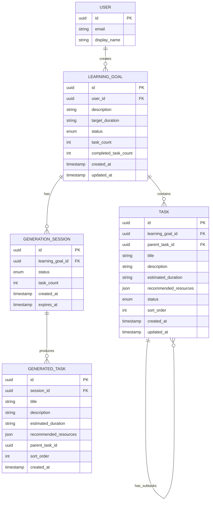

# Data Model: 修复学习目标生成学习计划功能

**Branch**: `002-fix-goal-plan-generation` | **Date**: 2026-06-23

## 实体关系图



---

## 实体定义

### 1. LearningGoal (学习目标)

**Table**: `learning_goals`

| Field                 | Type      | Constraints         | Description            |
| --------------------- | --------- | ------------------- | ---------------------- |
| id                    | UUID      | PK, auto-generate   | 主键                   |
| user_id               | UUID      | FK → users.id       | 所属用户               |
| description           | TEXT      | NOT NULL            | 学习目标描述           |
| target_duration       | VARCHAR   | NULLABLE            | 目标时长（如"2个月"）  |
| status                | ENUM      | NOT NULL, default 'active' | 状态：active/paused/completed/archived |
| task_count            | INT       | NOT NULL, default 0 | 总任务数               |
| completed_task_count  | INT       | NOT NULL, default 0 | 已完成任务数           |
| created_at            | TIMESTAMP | NOT NULL            | 创建时间               |
| updated_at            | TIMESTAMP | NOT NULL            | 更新时间               |

**Indexes**:
- `idx_learning_goals_user_id` (user_id)
- `idx_learning_goals_status` (status)
- `idx_learning_goals_created_at` (created_at DESC)

**State Transitions**:
```
active → paused (用户暂停)
active → completed (所有任务完成)
paused → active (用户恢复)
active → archived (用户归档)
paused → archived (用户归档)
completed → archived (用户归档)
```

---

### 2. Task (学习任务)

**Table**: `tasks`

| Field                 | Type      | Constraints         | Description            |
| --------------------- | --------- | ------------------- | ---------------------- |
| id                    | UUID      | PK, auto-generate   | 主键                   |
| learning_goal_id      | UUID      | FK → learning_goals.id | 所属学习目标        |
| parent_task_id        | UUID      | FK → tasks.id, NULLABLE | 父任务 ID（支持子任务） |
| title                 | VARCHAR   | NOT NULL            | 任务标题               |
| description           | TEXT      | NULLABLE            | 任务描述               |
| estimated_duration    | VARCHAR   | NULLABLE            | 预估时长（如"1周"）    |
| recommended_resources | JSON      | NULLABLE            | 推荐资源列表           |
| status                | ENUM      | NOT NULL, default 'todo' | 状态：todo/doing/done |
| sort_order            | INT       | NOT NULL, default 0 | 排序顺序               |
| created_at            | TIMESTAMP | NOT NULL            | 创建时间               |
| updated_at            | TIMESTAMP | NOT NULL            | 更新时间               |

**Indexes**:
- `idx_tasks_learning_goal_id` (learning_goal_id)
- `idx_tasks_parent_task_id` (parent_task_id)
- `idx_tasks_status` (status)
- `idx_tasks_sort_order` (sort_order)

**Constraints**:
- `parent_task_id` 不能等于 `id`（禁止自引用）
- `sort_order` 在同一 `parent_task_id` 下唯一

---

### 3. GenerationSession (生成会话) - **NEW**

**Table**: `generation_sessions`

| Field             | Type      | Constraints         | Description                    |
| ----------------- | --------- | ------------------- | ------------------------------ |
| id                | UUID      | PK, auto-generate   | 主键                           |
| learning_goal_id  | UUID      | FK → learning_goals.id | 关联的学习目标              |
| status            | ENUM      | NOT NULL, default 'generating' | 状态：generating/completed/expired |
| task_count        | INT       | NOT NULL, default 0 | 已生成任务数                   |
| created_at        | TIMESTAMP | NOT NULL            | 创建时间                       |
| expires_at        | TIMESTAMP | NOT NULL            | 过期时间（创建后 24 小时）     |

**Indexes**:
- `idx_generation_sessions_learning_goal_id` (learning_goal_id)
- `idx_generation_sessions_expires_at` (expires_at)

**State Transitions**:
```
generating → completed (用户确认保存)
generating → expired (超时 24 小时)
```

**Purpose**:
- 支持中断恢复：用户离开页面后可使用 session_id 重新连接
- 临时存储生成的任务，用户确认后再保存到 tasks 表
- 自动清理过期 session（定时任务）

---

### 4. GeneratedTask (生成的临时任务) - **NEW**

**Table**: `generated_tasks`

| Field                 | Type      | Constraints         | Description              |
| --------------------- | --------- | ------------------- | ------------------------ |
| id                    | UUID      | PK, auto-generate   | 主键                     |
| session_id            | UUID      | FK → generation_sessions.id | 所属生成会话      |
| title                 | VARCHAR   | NOT NULL            | 任务标题                 |
| description           | TEXT      | NULLABLE            | 任务描述                 |
| estimated_duration    | VARCHAR   | NULLABLE            | 预估时长                 |
| recommended_resources | JSON      | NULLABLE            | 推荐资源列表             |
| parent_task_id        | UUID      | NULLABLE            | 父任务 ID（临时）        |
| sort_order            | INT       | NOT NULL            | 排序顺序                 |
| created_at            | TIMESTAMP | NOT NULL            | 创建时间                 |

**Indexes**:
- `idx_generated_tasks_session_id` (session_id)

**Lifecycle**:
- AI 生成任务时插入此表
- 用户确认保存后，任务从 `generated_tasks` 复制到 `tasks` 表
- Session 过期或确认保存后，自动删除关联的 `generated_tasks`

---

## 数据完整性约束

### 1. 学习目标任务计数同步

**Trigger**: 当 `tasks` 表的 `learning_goal_id` 相关记录变化时，更新 `learning_goals.task_count` 和 `learning_goals.completed_task_count`

```sql
CREATE OR REPLACE FUNCTION update_learning_goal_task_counts()
RETURNS TRIGGER AS $$
BEGIN
    UPDATE learning_goals
    SET 
        task_count = (SELECT COUNT(*) FROM tasks WHERE learning_goal_id = NEW.learning_goal_id),
        completed_task_count = (SELECT COUNT(*) FROM tasks WHERE learning_goal_id = NEW.learning_goal_id AND status = 'done'),
        updated_at = NOW()
    WHERE id = NEW.learning_goal_id;
    RETURN NEW;
END;
$$ LANGUAGE plpgsql;
```

### 2. 生成会话过期清理

**定时任务**: 每小时清理过期的 `generation_sessions` 和关联的 `generated_tasks`

```sql
-- 删除过期 session 的 generated_tasks
DELETE FROM generated_tasks
WHERE session_id IN (
    SELECT id FROM generation_sessions
    WHERE expires_at < NOW() AND status = 'generating'
);

-- 删除过期 session
DELETE FROM generation_sessions
WHERE expires_at < NOW() AND status = 'generating';
```

### 3. 任务循环依赖检查

**Constraint**: 禁止 `parent_task_id` 形成循环

**Implementation**: 在应用层使用递归查询检查，或使用 PostgreSQL 的 `ltree` 扩展

---

## 迁移脚本

### Migration: 002_add_generation_sessions

```sql
-- 1. 创建 generation_sessions 表
CREATE TABLE generation_sessions (
    id UUID PRIMARY KEY DEFAULT gen_random_uuid(),
    learning_goal_id UUID NOT NULL REFERENCES learning_goals(id) ON DELETE CASCADE,
    status VARCHAR(20) NOT NULL DEFAULT 'generating' CHECK (status IN ('generating', 'completed', 'expired')),
    task_count INTEGER NOT NULL DEFAULT 0,
    created_at TIMESTAMP NOT NULL DEFAULT NOW(),
    expires_at TIMESTAMP NOT NULL DEFAULT NOW() + INTERVAL '24 hours'
);

CREATE INDEX idx_generation_sessions_learning_goal_id ON generation_sessions(learning_goal_id);
CREATE INDEX idx_generation_sessions_expires_at ON generation_sessions(expires_at);

-- 2. 创建 generated_tasks 表
CREATE TABLE generated_tasks (
    id UUID PRIMARY KEY DEFAULT gen_random_uuid(),
    session_id UUID NOT NULL REFERENCES generation_sessions(id) ON DELETE CASCADE,
    title VARCHAR(255) NOT NULL,
    description TEXT,
    estimated_duration VARCHAR(50),
    recommended_resources JSONB,
    parent_task_id UUID,
    sort_order INTEGER NOT NULL DEFAULT 0,
    created_at TIMESTAMP NOT NULL DEFAULT NOW()
);

CREATE INDEX idx_generated_tasks_session_id ON generated_tasks(session_id);

-- 3. 添加触发器同步任务计数
CREATE TRIGGER trigger_update_task_counts
AFTER INSERT OR UPDATE OR DELETE ON tasks
FOR EACH ROW
EXECUTE FUNCTION update_learning_goal_task_counts();
```
